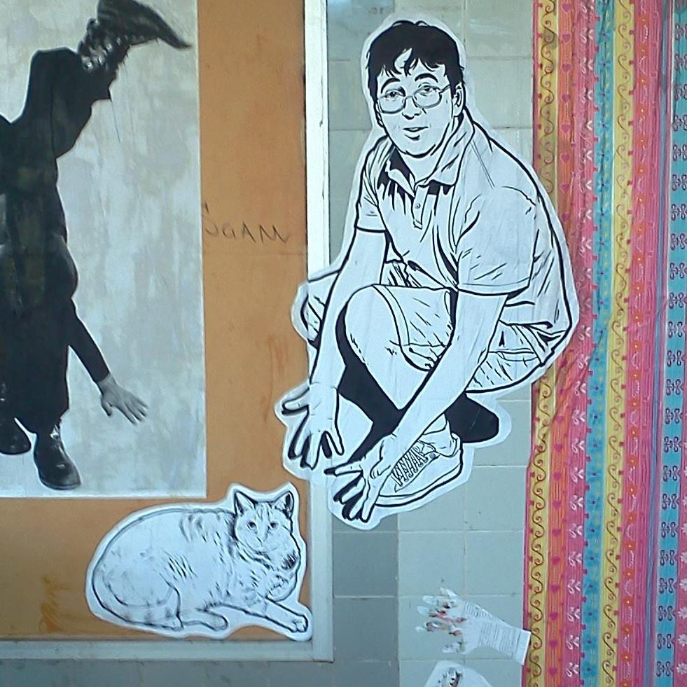

<style>
  .col2 {
    columns: 2 200px;         /* number of columns and width in pixels*/
    -webkit-columns: 2 200px; /* chrome, safari */
    -moz-columns: 2 200px;    /* firefox */
  }
  .col3 {
    columns: 3 100px;
    -webkit-columns: 3 100px;
    -moz-columns: 3 100px;
  }
</style>

<script type='text/javascript' src='https://d1bxh8uas1mnw7.cloudfront.net/assets/embed.js'></script>


<div class="col2">

[Google Scholar](http://scholar.google.com/citations?user=NTzu9c8AAAAJ&hl=en)<br> 
[Orcid](http://orcid.org/0000-0002-8747-2451)<br>
[ResearcherID](http://www.researcherid.com/rid/B-3821-2010)<br>
[Scopus](http://www.scopus.com/authid/detail.url?authorId=7202133982)<br>
[GitHub (RWTY)](https://github.com/danlwarren/RWTY)<br>
[GitHub (ENMTools)](https://github.com/danlwarren/ENMTools)<br>
[Twitter](https://twitter.com/danlwarren)<br>
[Blog](http://speciesinspace.com)<br>
[Soundcloud](soundcloud.com/danwarren/tracks)<br><br>
This is a piece street art by Ainsley Seago.  It's a depcition of me pointing at a fat cat named Ginger, and it's been up on the wall in Lyneham, ACT for several years now.  Lesson: if you spend enough time pointing at cats, the world will eventually recognize the skills.
</div>

# About Me

I have broad interests across evolution, ecology, biogeography, and conservation biology.  My primary research program focuses on using informatics approaches to answer large-scale questions in population biology, with a particular focus on species distribution models/environmental niche models.  I also have active research programs in phylogenetic methods and theory, and neuroecology of marine fishes.  I tend to do a lot of quantitative and computational methods development, and have developed several widely-used software packages for population biologists.

<br><br>


# Publications (last updated `r Sys.Date()`)

For the most up-to-date information on what I've been doing, check [Google Scholar](http://scholar.google.com/citations?user=NTzu9c8AAAAJ&hl=en).  You can also check me out on [Orcid](http://orcid.org/0000-0002-8747-2451), [ResearcherID](http://www.researcherid.com/rid/B-3821-2010), or [Scopus](http://www.scopus.com/authid/detail.url?authorId=7202133982), but those are updated considerably less often.
<br>
<br>
The following is scraped automatically from Google Scholar, CrossRef, and Altmetric.  It and may contain errors depending on API changes, formatting issues, or the direction of the wind.  For an up-to-date and correct CV, [email me](mailto:dan.l.warren@gmail.com).
<br>
<br>
<div class="col2">
```{r citeplot, echo = FALSE, tidy=TRUE, tidy.opts=list(width.cutoff=60), results="asis", fig.align="center"}
library(rcrossref)
library(pander)
library(scholar)
library(ggplot2)

ignore <- c("QIV2ME_5wuYC", "dhFuZR0502QC", "ULOm3_A8WrAC", "7PzlFSSx8tAC")

cites.per.year <- get_citation_history(id = "NTzu9c8AAAAJ")

cites <- get_publications(id = "NTzu9c8AAAAJ")

profile <- get_profile(id = "NTzu9c8AAAAJ")
  
# Casting years to character to facilitate plotting
cites.per.year$year <- as.character(cites.per.year$year)

# Plot cites per year
ggplot(cites.per.year, aes(year, cites)) + theme_bw() + geom_bar(stat="identity") + xlab("Year") + ylab("Number of Citations")

# Summary stats
cat(paste("Total citations:   <b>", profile$total_cites, "</b>"))
cat("<br>")
cat(paste("h index:   <b>", profile$h_index, "</b>"))
cat("<br>")
cat(paste("i-10 index:   <b>", profile$i10_index, "</b>"))
cat("\n\n\n")
```
</div>

```{r citations, echo = FALSE, tidy=TRUE, tidy.opts=list(width.cutoff=60), results="asis", fig.align="center"}
cites <- cites[-which(as.character(cites$pubid) %in% ignore),]
cites <- cites[order(-cites$year),]
formatted <- apply(cites, 1, function(x) paste0(x["author"], ". (", x["year"], "). ", x["title"], ". ", x["journal"], " ", x["number"], ".<br>Citations: <b>", x["cites"], "</b>", "<div class='altmetric-embed' data-badge-type='1' data-doi=\"", cr_works(query = paste(as.character(x[1:4]), collapse = " "))$data[1,"DOI"], "\"></div><br>"))

pandoc.list(formatted, loose = FALSE)
```
